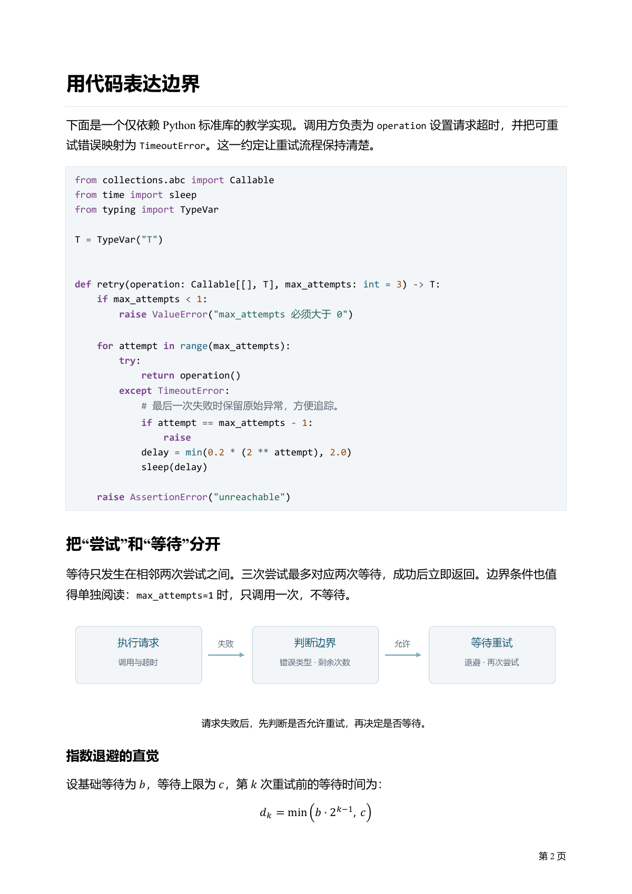

# Typora Word 导出模板

两套面向 Windows Typora 的 Word 样式。选一个 `.docx` 作为样式参考，即可导出带标题、列表、表格、代码和页码的文档。

## 下载与使用

| 模板 | 适用场景 | 下载 |
|---|---|---|
| **标准黑白** | 常规文档；宋体正文、黑体标题、细网格表格 | [standard.docx](templates/standard.docx) |
| **技术文档** | 技术文章；微软雅黑正文、代码高亮、浅色引用与表格 | [tech.docx](templates/tech.docx) |

1. 下载模板，放到 Windows 本地固定目录。
2. 在 Typora **偏好设置 → 导出 → Word (.docx) → 样式参考**中选择模板。
3. 执行 **文件 → 导出 → Word (.docx)**。切换风格时更换样式参考即可。

完整下载包见 [Releases](https://github.com/taifuer/typora-template/releases)，也可直接使用上方模板。模板里的介绍文字不会出现在导出文档中。

## Demo 预览

左侧为 Markdown 预览，右侧为对应内容的 Word 导出效果。点击图片可查看大图。

### 标准黑白

| Markdown 预览 | Word · 第 1 页 |
|:---:|:---:|
|  |  |

### 技术文档

| Markdown 预览 | Word · 第 2 页 |
|:---:|:---:|
|  |  |

完整样例：

- 标准黑白：[Word](examples/standard.docx) · [PDF](previews/standard.pdf) · [Markdown](examples/standard.md)
- 技术文档：[Word](examples/technical-blog.docx) · [PDF](previews/technical-blog.pdf) · [Markdown](examples/technical-blog.md)
- 元素覆盖：[Word](examples/style-coverage.docx) · [PDF](previews/style-coverage.pdf)

## 说明

- **对齐**：表格整体和带题注图片默认居中，表内文字遵循 Markdown 列对齐。无题注图片可在 Word 中将所在段落居中。
- **代码**：标注代码块语言，技术版即可高亮；标准版保持黑白，代码均可编辑。
- **字体**：普通英文使用 Times New Roman，代码使用 Windows 自带的 Consolas；无需额外安装代码字体。
- **版面**：A4 纸张，正文不自动首行缩进。其他系统缺少字体时，分页可能变化，可用 PDF 保留阅读效果。

图片自动居中、目录等可选设置见 [详细说明](docs/style-decisions.md)。开发者可参阅 [构建与验证](docs/validation.md)和 [发布流程](docs/releasing.md)。
