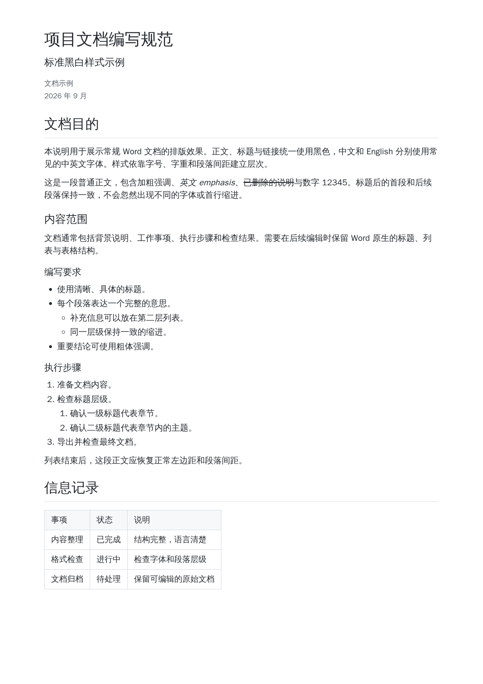
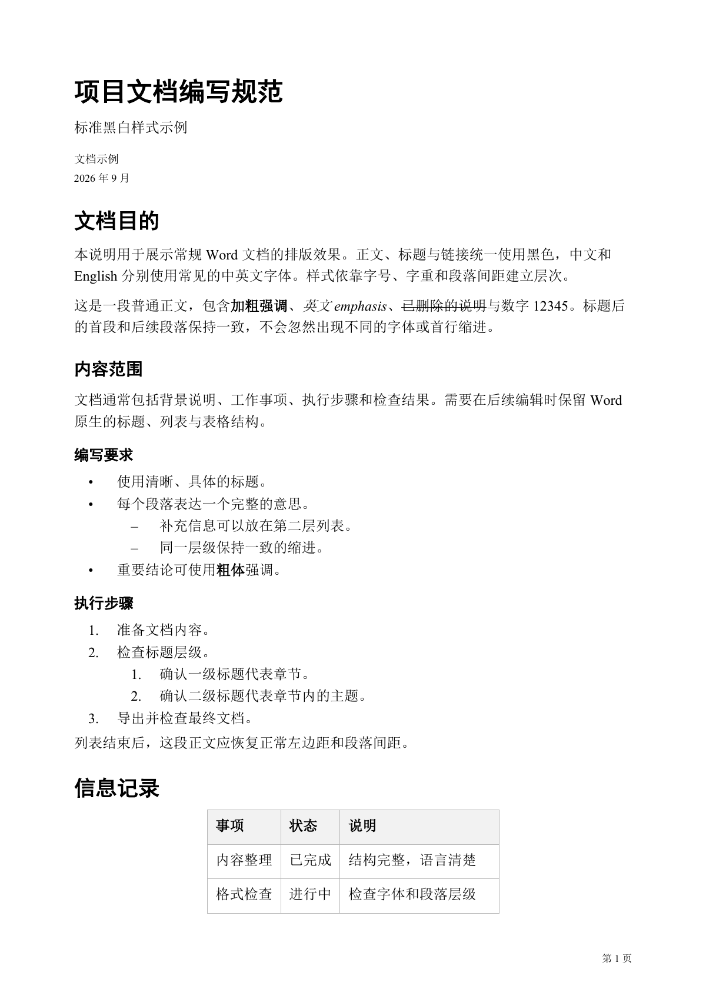
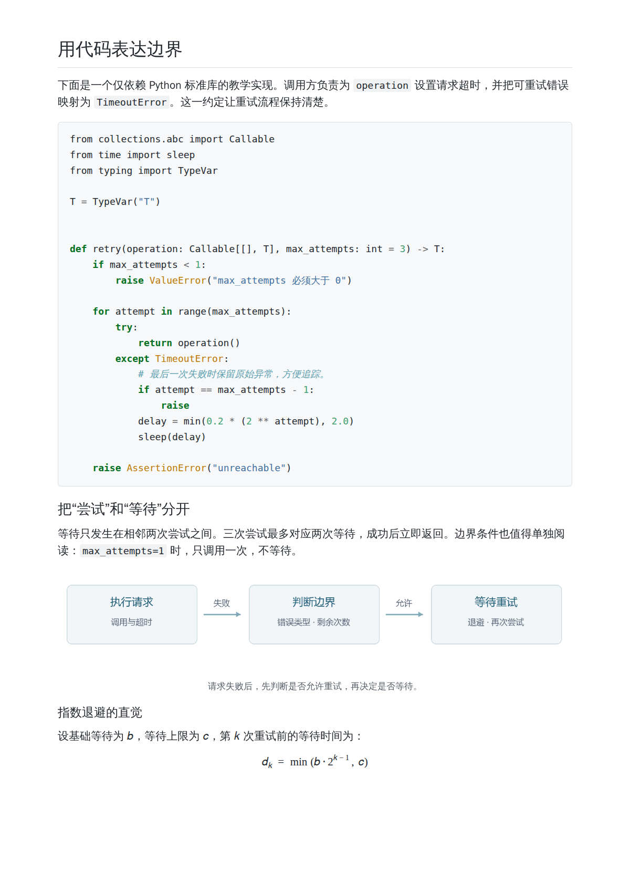
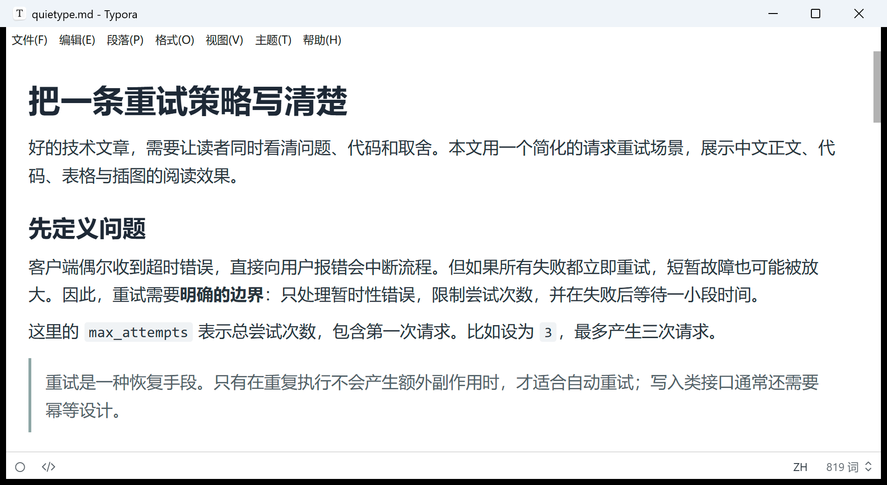
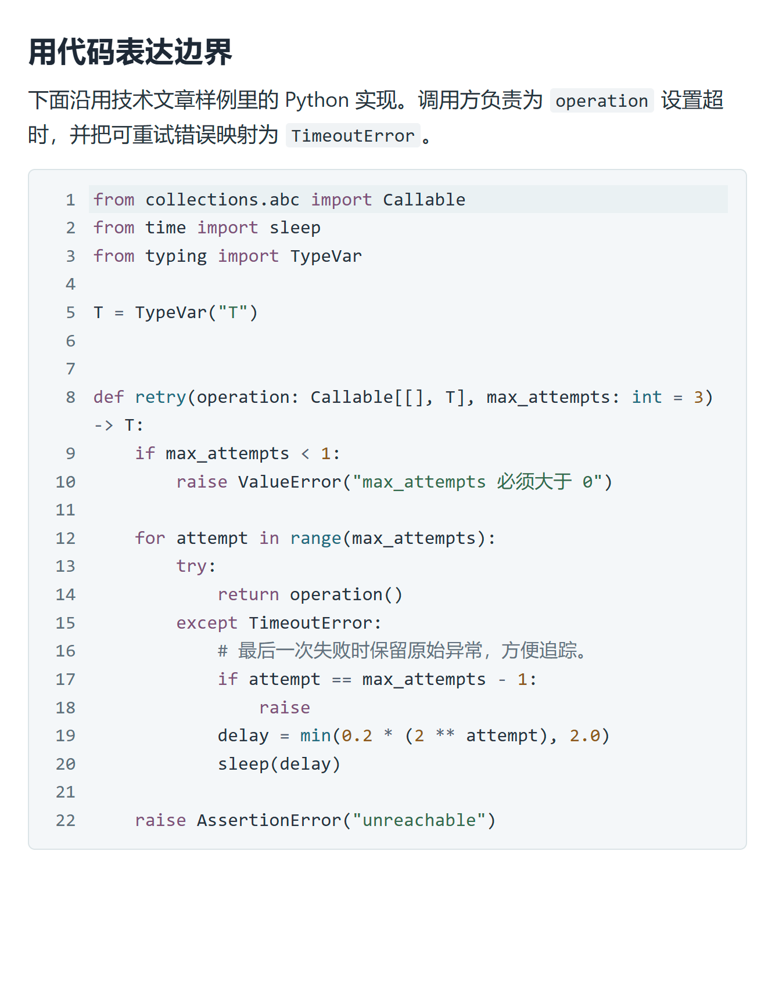

# Typora Template

为 Typora 提供 Word 导出模板和简洁的技术文章阅读主题。

- **[Word 导出模板](word/README.md)**：标准黑白、技术文档两套样式，包含标题、代码、列表、图表和页码。
- **[Quietype 阅读主题](themes/quietype/README.md)**：纯白背景、宽正文、紧凑间距，配套代码高亮、Mermaid 和公式样式。

两部分可以分别使用。Word 模板控制导出文档的排版，Quietype 控制编辑器里的阅读效果。

## 使用

在同一个 [Release](https://github.com/taifuer/typora-template/releases/latest) 中按需下载：Word 包只含两份 DOCX 模板，主题包只含 `quietype.css`。说明、样例和预览保留在仓库中。

| 内容 | 下载包 | 单独下载 |
|---|---|---|
| Word 导出模板 | [typora-word-0.2.1.zip](https://github.com/taifuer/typora-template/releases/download/v0.2.1/typora-word-0.2.1.zip) | [standard.docx](https://github.com/taifuer/typora-template/releases/latest/download/standard.docx) · [tech.docx](https://github.com/taifuer/typora-template/releases/latest/download/tech.docx) |
| Quietype 阅读主题 | [quietype-0.2.1.zip](https://github.com/taifuer/typora-template/releases/download/v0.2.1/quietype-0.2.1.zip) | [quietype.css](https://github.com/taifuer/typora-template/releases/latest/download/quietype.css) |

### 导出 Word

1. 将 `standard.docx` 或 `tech.docx` 保存到本地固定目录。
2. 在 Typora **偏好设置 → 导出 → Word (.docx) → 样式参考**中选择该文件。
3. 执行 **文件 → 导出 → Word (.docx)**。

### 安装 Quietype

1. 在 Typora **偏好设置 → 外观 → 打开主题文件夹**中放入 `quietype.css`。
2. 重启 Typora，在 **主题**菜单中选择 **Quietype**。

Quietype 是独立的单文件主题，无需其他主题 CSS 或额外字体。

## 演示

### Word 导出模板

左侧是 Markdown 渲染预览，右侧是对应内容的 Word 导出效果。点击图片查看大图。

**标准黑白**

| Markdown | Word · 第 1 页 |
|:---:|:---:|
|  |  |

**技术文档**

| Markdown | Word · 第 2 页 |
|:---:|:---:|
|  |  |

### Quietype 阅读主题

下面两张为 Windows Typora 1.12.4 正文区域的实机截图，分别展示正文和代码。更多图形和公式效果见[主题演示](themes/quietype/README.md#演示)。

| 正文与图表 | 代码与高亮 |
|:---:|:---:|
|  |  |

## 开发者

Word 的资料和脚本位于 `word/`，主题位于 `themes/quietype/`。构建与验证见 [Word 文档](word/docs/validation.md)和 [Quietype 文档](themes/quietype/docs/development.md)；打包与发布见[发布流程](docs/releasing.md)。
