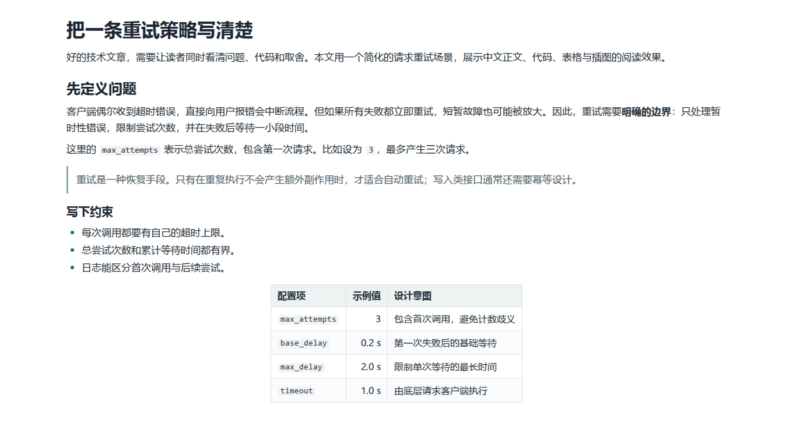
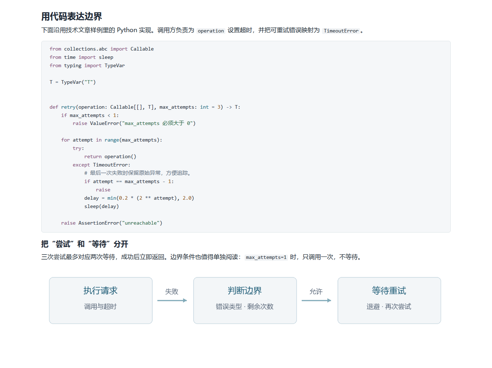
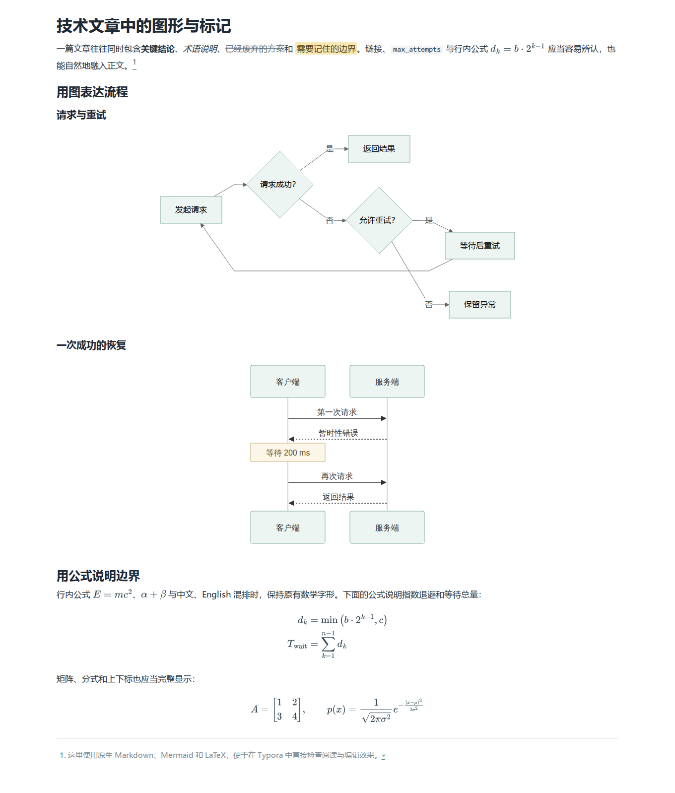
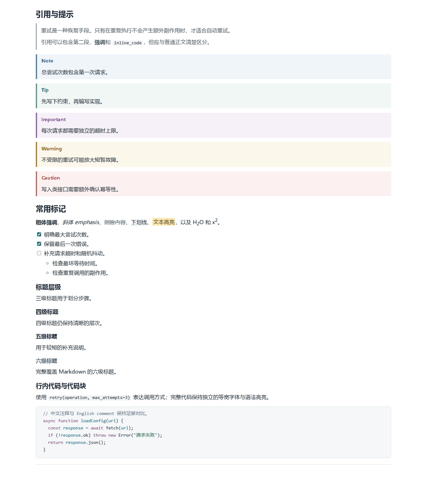

# Quietype

适合中文技术文章阅读的 Typora 主题。纯白背景、深灰文字、宽正文和紧凑间距，让段落、代码与图形保持清楚的层次。

- 标题通过字号、字重和间距区分层级。
- 行内代码采用深灰文字与浅灰底，代码块保留语法高亮和等宽排版。
- 配套引用、提示框、表格、Mermaid、公式及常用 Markdown 标记样式。

## 演示

以下为 Windows Typora 1.12.4 实机截图，系统缩放 200%。点击图片查看大图。

### 正文与引用

### 行内代码与代码块

更多元素：表格、插图、Mermaid、公式与提示框

下面是使用本机 Typora 渲染组件生成的浏览器预览。

| 正文与表格 | 代码与插图 |
|:---:|:---:|
|  |  |

| Mermaid 与公式 | 提示框与常用标记 |
|:---:|:---:|
|  |  |

## 使用

下载 [Quietype 主题包](https://github.com/taifuer/typora-template/releases/download/v0.2.0/quietype-0.2.0.zip)，或单独下载 [quietype.css](https://github.com/taifuer/typora-template/releases/latest/download/quietype.css)。

1. 在 Typora **偏好设置 → 外观 → 打开主题文件夹**中放入 `quietype.css`。
2. 重启 Typora，在 **主题**菜单中选择 **Quietype**。
3. 打开包内的[试读文章](examples/quietype.md)或[元素样例](examples/quietype-elements.md)，查看完整效果。保留样例旁的 `assets/` 文件夹即可显示插图。

Quietype 继承 Typora 自带的 GitHub 样式，需要主题文件夹中保留 `github.css` 及其字体资源目录。

## 说明

- **正文**：背景为纯白 `#fff`，默认字号 17px、行距 1.65；阅读区最大宽度 1180px，窄窗口自动收缩。字号可在 Typora 外观设置中调整。
- **字体**：使用本机系统字体；Windows 正文使用微软雅黑，英文代码使用 Consolas，中文代码另设无衬线字体回退。
- **图表**：独立图片、表格整体居中；表格列对齐遵循 Markdown。Mermaid 的自定义节点配色仍可生效。
- **编辑**：保留代码换行设置、Markdown 标记和数学字形；代码与提示框使用浅底区分内容。
- **Word 导出**：使用参考 DOCX 控制排版，主题 CSS 不会改变 Word 导出样式。

## 开发者

主题样式位于 `quietype.css`，预览脚本位于 `scripts/`。渲染环境、验证范围和预览生成方法见[开发与验证](docs/development.md)。
