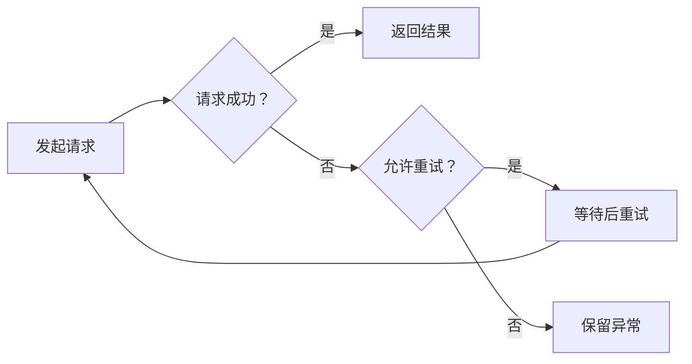
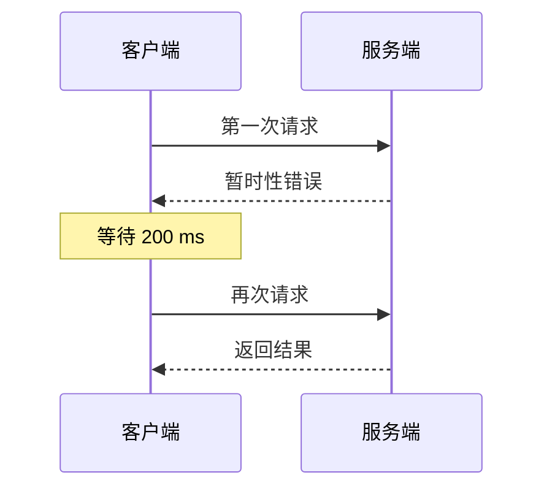

# 技术文章中的图形与标记

一篇文章往往同时包含**关键结论**、*术语说明*、~~已经废弃的方案~~和 ==需要记住的边界==。链接、`max_attempts` 与行内公式 $d_k = b \cdot 2^{k-1}$ 应当容易辨认，也能自然地融入正文。[^note]

## 用图表达流程

### 请求与重试



### 一次成功的恢复



## 用公式说明边界

行内公式 $E = mc^2$、$\alpha + \beta$ 与中文、English 混排时，保持原有数学字形。下面的公式说明指数退避和等待总量：

$$
\begin{aligned}
d_k &= \min\left(b \cdot 2^{k-1}, c\right) \\
T_{\mathrm{wait}} &= \sum_{k=1}^{n-1} d_k
\end{aligned}
$$

矩阵、分式和上下标也应当完整显示：

$$
A = \begin{bmatrix} 1 & 2 \\ 3 & 4 \end{bmatrix},
\qquad p(x) = \frac{1}{\sqrt{2\pi\sigma^2}} e^{-\frac{(x-\mu)^2}{2\sigma^2}}
$$

## 引用与提示

> 重试是一种恢复手段。只有在重复执行不会产生额外副作用时，才适合自动重试。
>
> 引用可以包含第二段、**强调**和 `inline_code`，但应与普通正文清楚区分。

> [!NOTE]
> 总尝试次数包含第一次请求。

> [!TIP]
> 先写下约束，再编写实现。

> [!IMPORTANT]
> 每次请求都需要独立的超时上限。

> [!WARNING]
> 不受限的重试可能放大短暂故障。

> [!CAUTION]
> 写入类接口需要额外确认幂等性。

## 常用标记

**粗体强调**、*斜体 emphasis*、~~删除内容~~、<u>下划线</u>、==文本高亮==，以及 H~2~O 和 x^2^。

- [x] 明确最大尝试次数。
- [x] 保留最后一次错误。
- [ ] 补充请求超时和随机抖动。
  - 检查最坏等待时间。
  - 检查重复调用的副作用。

### 标题层级

三级标题用于划分步骤。

#### 四级标题

四级标题仍保持清晰的层次。

##### 五级标题

用于较短的补充说明。

###### 六级标题

完整覆盖 Markdown 的六级标题。

### 行内代码与代码块

使用 `retry(operation, max_attempts=3)` 表达调用方式；完整代码保持独立的等宽字体与语法高亮。

```javascript
// 中文注释与 English comment 保持足够对比。
async function loadConfig(url) {
  const response = await fetch(url);
  if (!response.ok) throw new Error("请求失败");
  return response.json();
}
```

---

[^note]: 这里使用原生 Markdown、Mermaid 和 LaTeX，便于在 Typora 中直接检查阅读与编辑效果。
